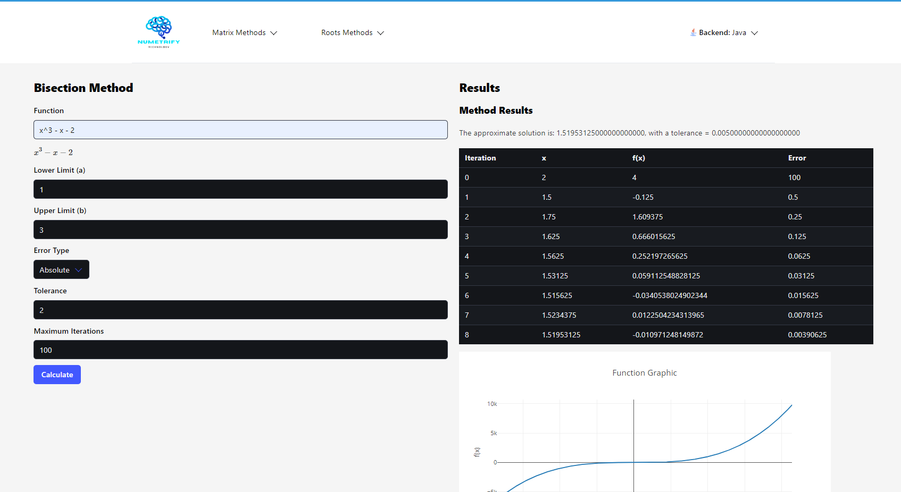

  

# Numetrify

Numetrify is an interactive web application designed to facilitate the implementation and visualization of various numerical methods for solving equations and systems of equations. Aimed at students and researchers, Numetrify provides an intuitive interface for inputting matrices and vectors, allowing users to easily manipulate and modify their data. The application leverages advanced graphical and tabular representations to display results, making complex numerical computations more accessible and understandable. Whether you are working on academic studies or conducting research projects, Numetrify serves as a powerful tool to apply numerical methods effectively, enhancing both learning and productivity in the field of numerical analysis.

## Features

Numetrify includes the following numerical methods:

- **Root Finding Methods:**
  - False Rule Method
  - Bisection Method
  - Fixed Point Method
  - Incremental Search Method
  - Multiple Roots Method
  - Newton-Raphson Method
  - Secant Method

- **Solving Systems of Linear Equations:**
  - Cholesky Method
  - Crout Method
  - Doolittle Method
  - Simple Gaussian Elimination Method
  - Pivot Gaussian Elimination Method
  - LU Gaussian Elimination Method
  - Jacobi Method
  - Gauss-Seidel Method

## Multi Backend Support

Numetrify supports multi backend configurations, allowing users to choose between Java and Python for the backend implementation.

<pre>
backend/
├── java/
└── python/
frontend/
</pre>

## Screenshot

## User Manual

For detailed instructions on how to use Numetrify, please refer to the [User Manual](path/to/user_manual.pdf).

## Creators

Numetrify was created by:

- **Abraham Lora**
- **Sebastian Escobar**
- **Camilo Soto**

## Getting Started

To get started with Numetrify, clone this repository and follow the setup instructions in the user manual.

## License

This project is licensed under the MIT License - see the [LICENSE](LICENSE) file for details.
